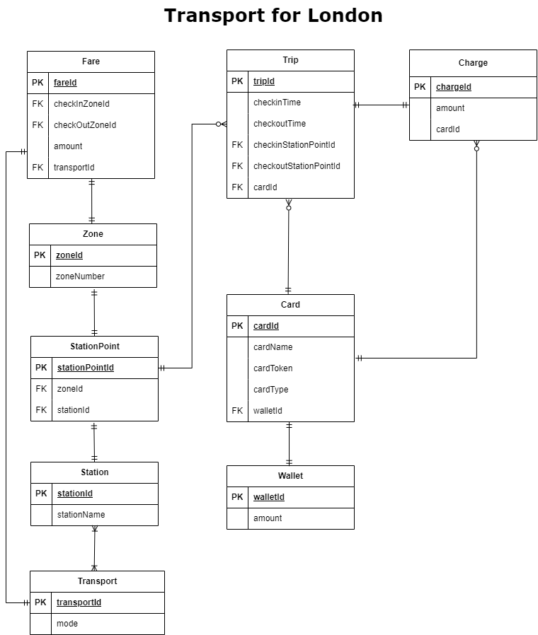

# Transport for London (TfL) Mini API

## Overview

This project is a simplified version of the Transport for London (TfL) system, designed to simulate the London Transportation Network. It provides an API to manage transportation cards, track trips, and calculate fares based on stations and zones.


## Table of Contents

- [Overview](#overview)
- [Features](#features)
- [Technologies Used](#technologies-used)
- [Database Design](#database-design)
- [API Endpoints](#api-endpoints)
- [Setup and Installation](#setup-and-installation)
- [Usage](#usage)
- [Testing](#testing)

## Features

- **Card Management**: Manage transportation cards, each linked to a wallet holding the card balance.
- **Trip Recording**: Track trips made with the card, including check-in and check-out stations.
- **Station and Zone Management**: Handle stations and their corresponding zones.
- **Fare Calculation**: Calculate trip fares based on the zones and transportation mode.

## Technologies Used

- **Java 17**
- **Spring Boot**
- **Spring Data JPA**
- **H2 Database (for development and testing)**
- **JUnit & Mockito** (for testing)
- **Maven** (for build automation)
- **Swagger** (for API documentation)


## Database Design

The database design revolves around the following key tables:

- **Card**: Stores card details and links to a wallet.
- **Wallet**: Holds the balance associated with a card.
- **Trip**: Records trips made with a card, including check-in and check-out stations.
- **Station**: Represents stations, each linked to a zone.
- **Zone**: Stores zone information, used to calculate fares.
- **Fare**: Stores fare rates based on zones and transport modes.

## API Endpoints

### Card API

- `POST /api/v1/card/create` - Create a new card.
- `GET /api/v1/card/{id}` - Retrieve card details by ID.


### Trip API

- `POST /api/v1/trip/checkin` - Record a new trip.
- `PUT /api/v1/trip/checkout` - Update the check-out station for an existing trip.


## Setup and Installation

### Prerequisites

- Java 17
- Maven

### Installation

1. **Clone the repository:**

    ```bash
    git clone https://github.com/ezemery/tfl-mini-springboot.git
    cd tfl-mini-api
    ```

2. **Build the project:**

    ```bash
    mvn clean install
    ```

3. **Run the application:**

    ```bash
    mvn spring-boot:run
    ```

## Usage

Once the application is running, you can interact with the API using tools like Postman or cURL. The application runs on `http://localhost:8080` by default.

To view the API documentation, visit: `http://localhost:8080/swagger-ui/`

## Testing

To run the tests, use:

```bash
mvn test


